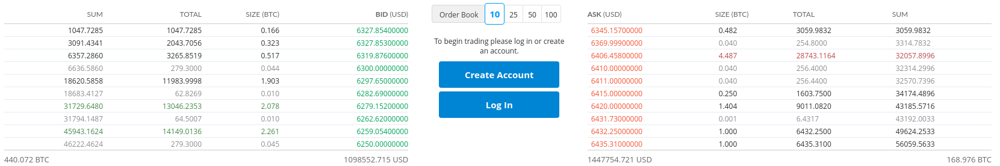
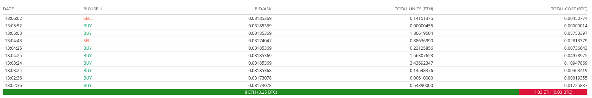
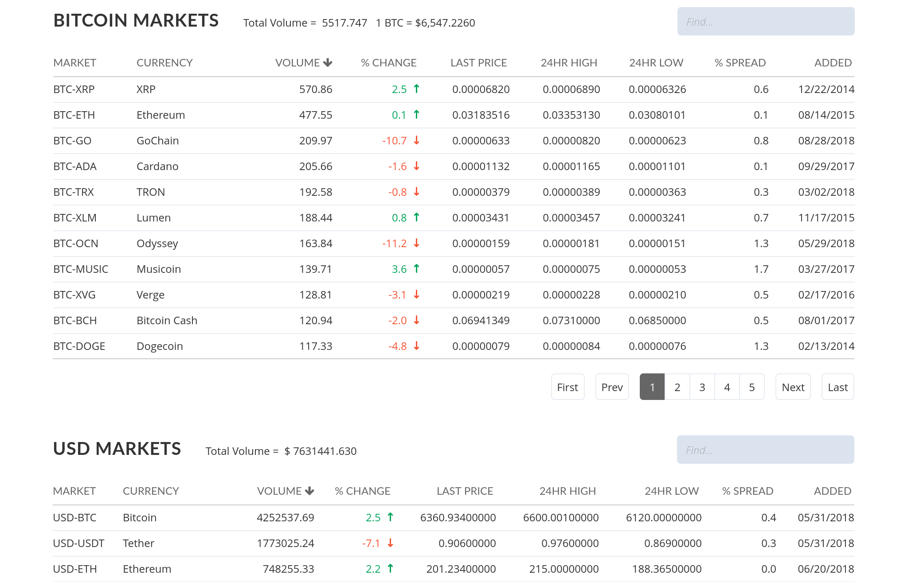

# bittrex-enhance

Some personal script to make bittrex more convenient to use?.
Only tested on Chrome with Tampermonkey.

## Install
  1. Download [Tampermonkey](https://chrome.google.com/webstore/detail/tampermonkey/dhdgffkkebhmkfjojejmpbldmpobfkfo?hl=hu)
  2. Copy the script you want to use and **verify the content**
  3. Click on the Tampermonkey badge and click "Create new script..."
  4. Paste the script then save it (`File => Save` or `Ctrl+s`)

## Colored Orderbook

Colorize the orderbook based on the order size. 

## Market Histrory Bar

Display the buy/sell ratio on a bar.

## Swap BTC and USD Market

The main page will start with the BTC markets.

